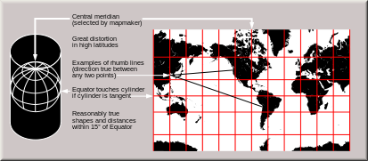

```{r setup, include=FALSE}
knitr::opts_chunk$set(echo = FALSE)
```

## Roteiro

1. Geoprocessamento e Sistemas de Informação Geográfica
2. Sistemas de projeção
3. Tipos de dados
4. Pacotes R utilizados
5. [Exemplos para dados vetoriais](dados_vetoriais.html)
6. Exemplos para dados raster
   + [Pacote *raster*](dados_raster.html)
   + [Pacote *stars*](dados_stars.html)
7. [Mapas dinâmicos](dinamicos.html)

## O que temos em comum?

<div style="float: left; width: 50%;">
<br />

</div>

<div style="float: right; width: 50%;">
<br />

</div>

<div style="float: left; width: 50%;">

</div>

<div style="float: right; width: 50%;">

</div>

## Localização espacial

<div style="float: left; width: 50%;">

</div>

<div style="float: right; width: 50%;">

</div>

## Sistemas de Informação Geográfica (SIGs)

- Geoprocessamento
  - Tecnologias voltadas para a coleta e tratamento de informações espaciais
  - Inclui coleta de dados, armazenamento, manipulação, gerenciamento, análise, produção de novas informações etc
- Forte desenvolvimento incluindo soluções para o público em geral (Google maps)

## Sistemas de Informação Geográfica (SIGs)

Sistemas para processamento de dados gráficos e não gráficos, com ênfase em análises espaciais.

<font size=5>

   - *"Um conjunto manual ou computacional de procedimentos utilizados para armazenar e manipular dados georeferenciados" (Aronoff, 1989).*
   - *"Conjunto poderoso de ferramentas para coletar, armazenar, recuperar, transformar e visualizar dados sobre o mundo real" (Burrough, 1986).*
   - *"Um sistema de suporte à decisão que integra dados referenciados espacialmente num ambiente de respostas a problemas" (Cowen, 1988).*
   - *"Um banco de dados indexados espacialmente, sobre o qual opera um conjunto de procedimentos para responder a consultas sobre entidades espaciais" (Smith et al., 1987)*

</font>

## Sistemas de Informação Geográfica (SIGs)

<div style="float: left; width: 50%;">
**Elementos básicos**<br>
- Hardware<br>
- Software<br>
- Dados<br>
- Profissionais<br>
- Métodos
</div>

<div style="float: right; width: 50%;">
**Funcionalidades**<br>
- Banco de dados espaciais e atributos<br>
- Sistemas para apresentação cartográfica<br>
- Edição de mapas<br>
- Análise geográfica<br>
- Processamento de imagens
</div>

## John Snow - Cólera no bairro Soho, Londres, 1854

<div style="float: left; width: 70%;">

</div>

<div style="float: right; width: 20%;">

</div>

## Operações que podem ser feitas {.columns-2 }

- Distância
- Transformação de coordenadas
- Buffer
- Delimitação de bacias
- Superfície de custo
- Transformação de formato
- Álgebra de mapas

<br> 

- Segmentação de imagens
- Recorte
- União (join)
- Classificação de imagens
  - Supervisionada
  - Não supervisionada
- ...


## A Terra não é plana
<center>

</center>

- Sistema de Coordenadas (CRS - coordinate reference system)
  - Determinar a localização na superfície da Terra
  - Depende da representação da terra (esfera, elipsoide)
  - Coordenadas esféricas
  - Datum: WGS84 - utilizado pelo sistema GPS
  - Sirgas2000; SAD69; Corrego Alegre

## Projeção Cartográfica

- Coordenadas planas
- Distorce alguma característica
  - Área
  - Forma
  - Comprimento


{width=40%} 

{width=40%}

## Pondo ordem na bagunça

- Importante que dados estejam no *mesmo sistema de projeção* para se fazer a análise
- Alguns SIGs fazem transformação automática.
- Código [EPSG](https://epsg.io/)
  - Catálogo de sistemas de projeção comumente utilizadas
  - Facilitar interoperabilidade
  - EPSG:4326 - Coordenadas Geográficas, WGS84
  - EPSG:32722 - UTM Zona 22 S, WGS84
  - EPSG:31982 - UTM Zona 22 S, Sirgas 2000

## Transformações de projeção / coordenadas

- Uso da biblioteca / software PROJ
   - https://proj.org/index.html
- Lista de projeções
   - https://proj.org/operations/projections/index.html
- Proj strings
   - +proj=merc +lat_ts=56.5 +ellps=GRS80

## Tipos de dados 
### Diferentes formas de representar dados espaciais {.columns-2 }

<div style="float: left; width: 50%;">
**Vetorial**<br>
- Pontos, linhas polígonos<br>
- Topologia (vizinhança, sobreposição...)<br>
- Exatidão gráfica (ponto é sempre ponto)<br>
- Tabela de atributos associada<br>
  - Shapefiles<br>
  - GeoPackage<br>
  - GeoJSON<br>
  - PostGIS<br>
</div>

<div style="float: right; width: 50%;">
**Matricial**<br>
- linhas / colunas<br>
- Pixel: menor unidade - resolução espacial<br>
- Estrutura simples<br>
- Grande volume de dados<br>
  - GeoTIFF<br>
  - IMG<br>
  - NetCDF<br>
</div>

## Vetor vs. Raster {.columns-2 }

{ width=80% }

<br>


## Pacotes para dados geoespaciais
### Como tudo no R, muitos pacotes

[CRAN Task View: Analysis of Spatial Data](https://cran.r-project.org/web/views/Spatial.html)

- rgdal
- sp
- raster
- rgrass7
- rqgis
- sf
- stars
- gstats
- ...

## Pacotes para dados geoespaciais

rgdal

- ler / escrever dados raster ou vetorias
- ligação com GDAL / OGR
- transformações de projeção

raster

- ler / escrever dados raster
- funções para processar dados
- utiliza rgdal e outras bibliotecas

sp

- classes e métodos para tratar dados espaciais

## Pacotes mais rescentes

sf

- Simple Features for R
- padrão OGC
- implementação mais moderna do *sp*
- segue *tidyverse*

stars

- Spatial Temporal Arrays
- Cubo de dados raster e vetorial
- segue *tidyverse*

https://github.com/r-spatial

<font size=1>Daniel: Em processo de transição do *raster* para o *stars*</font>

## Referências

- [CRAN Task View: Analysis of Spatial Data](https://cran.r-project.org/web/views/Spatial.html)
- [Geocomputation with R](https://bookdown.org/robinlovelace/geocompr/)

## Fim introdução

- [Dados vetoriais](dados_vetoriais.html)
- [Pacote raster](dados_raster.html)
- [Pacote stars](dados_stars.html)
- [Mapas dinâmicos](dinamicos.html)

## sessionInfo {.smaller}
```{r}
print(sessionInfo(), locale = FALSE)
```

